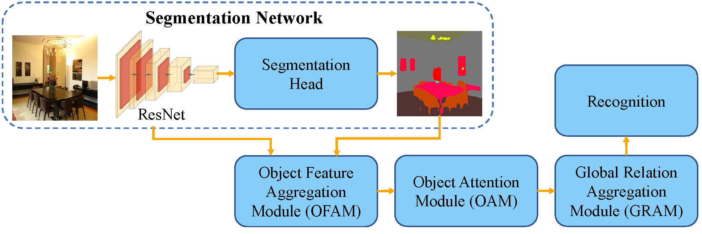

# Object-to-Scene: Learning to Transfer Object Knowledge to Indoor Scene Recognition

This repository contains the source code (PyTorch) for our paper:

[**Object-to-Scene: Learning to Transfer Object Knowledge to Indoor Scene Recognition**](https://arxiv.org/abs/2108.00399)




## Pre-trained model
- The pre-trained model can be downloaded at [Google drive](https://drive.google.com/drive/folders/1WSJUyBDjm2K23dLylDoAhnJdNvqi6c-U?usp=sharing). 
- Put the pre-trained model in the `ckpt` folder.


## Introduction
- The entrance file of test codes is `main.py`.
- The main arguments and functions are in `functions.py`.


## Citation
If you find the paper, code, or pre-trained models useful, please cite the following papers:

```
@InProceedings{Miao2021ots,
  author        = {Bo Miao and Liguang Zhou and Ajmal Mian and Tin Lun Lam and Yangsheng Xu},
  title         = {Object-to-Scene: Learning to Transfer Object Knowledge to Indoor Scene Recognition},
  booktitle     = {IEEE/RSJ International Conference on Intelligent Robots and Systems},
  year          = {2021},
  organization  = {IEEE}
}

@InProceedings{Zhou21borm,
  author        = {Liguang Zhou and Cen Jun and Xingchao Wang and Zhenglong Sun and Tin Lun Lam and Yangsheng Xu},
  title         = {BORM: Bayesian Object Relation Model for Indoor Scene Recognition},
  booktitle     = {IEEE/RSJ International Conference on Intelligent Robots and Systems},
  year          = {2021},
  organization  = {IEEE}
}
```


